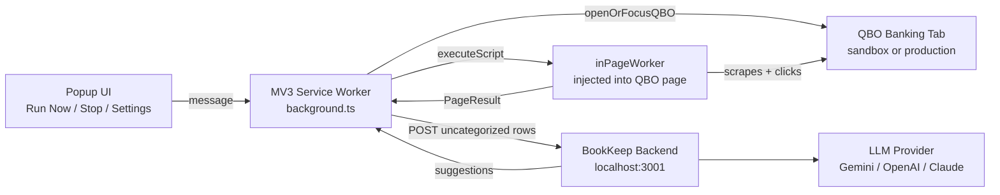
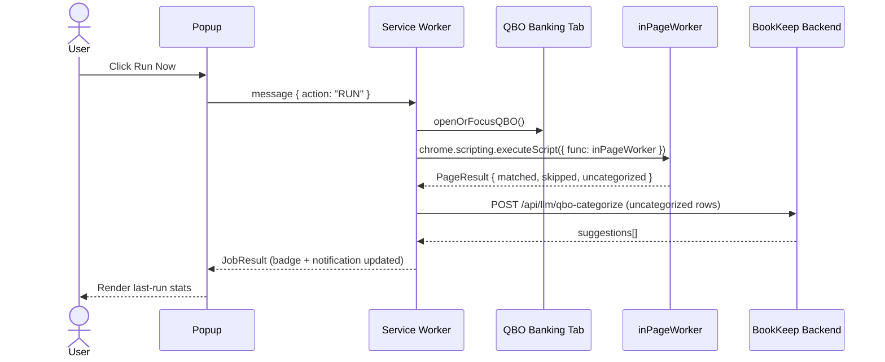

# Web Extension Architecture

Last source review: 2026-05-07

AI-agent orientation map for `web_extension/`. This is the Chrome MV3 extension that automates the QuickBooks Online Banking UI — it fills the gap that the QBO public API cannot reach: the For Review tab.

---

## What This Extension Does

1. Opens or focuses the QBO Banking tab.
2. Injects an in-page worker that scrapes the For Review rows.
3. For rows with a single AI match suggestion → clicks **Match** automatically.
4. For uncategorized rows → POSTs them to the BookKeep backend for LLM categorization.
5. Reports results (matched count, skipped, errors) back to the popup.

The extension does **not** currently apply LLM suggestions back into QBO. The backend returns category suggestions but the extension does not click QBO dropdowns to apply them yet.

---

## Top-Level System Graph



---

## Source Layout

```text
web_extension/
  manifest.json                  Chrome MV3 manifest. Permissions + host_permissions.
  package.json                   Vite + @crxjs/vite-plugin build setup.
  vite.config.ts                 Vite config. Outputs to dist/.
  tsconfig.json                  TypeScript config.
  src/
    types.ts                     All shared DTOs and DEFAULT_SETTINGS.
    background/
      background.ts              MV3 service worker. Entry point for all automation.
    popup/
      index.html                 Popup shell.
      popup.ts                   Popup event wiring and state rendering.
      style.css                  Popup styles.
  public/                        Static assets (icons).
  server/
    index.js                     Dev stub server only. Not used in production.
  dist/                          Build output. Load this folder in Chrome.
```

---

## Runtime Components

| Component | Entry | Notes |
|-----------|-------|-------|
| MV3 service worker | `src/background/background.ts` | Persistent background page. Handles all orchestration, alarm scheduling, badge updates. |
| In-page worker | Function injected via `chrome.scripting.executeScript` | Runs inside the QBO tab. Scrapes rows, clicks Match, returns `PageResult`. No shared scope with service worker. |
| Popup | `src/popup/index.html` + `popup.ts` | Communicates with service worker via `chrome.runtime.sendMessage`. |

---

## Manifest Permissions

```json
"permissions": ["activeTab", "scripting", "tabs", "storage", "alarms", "notifications"]
"host_permissions": [
  "https://sandbox.qbo.intuit.com/*",
  "https://app.qbo.intuit.com/*",
  "http://localhost:3001/*"
]
```

Adding new QBO environments requires updating `host_permissions` and the URL map in `background.ts`.

---

## Data Types (`src/types.ts`)

```ts
Transaction         // Row extracted from QBO DOM: id, date, description, amount, type, vendor
MatchAttempt        // Result of a single-match click: transactionId, success, error?
SkippedRow          // Row skipped with reason: transactionId, reason
PageResult          // Return from inPageWorker: matched[], skipped[], uncategorized[], errors[]
JobResult           // Full run result: pageResult, backendSuggestions[], totalProcessed, duration
Settings            // User-configurable: backendUrl, qboEnvironment, scheduleEnabled, scheduleTime
DEFAULT_SETTINGS    // backendUrl: "http://localhost:3001/api/llm/qbo-categorize", qboEnvironment: "sandbox", scheduleEnabled: false, scheduleTime: "09:00"
```

Settings are persisted via `chrome.storage.local`.

---

## Core Flows

### 1. Run Now (Manual Trigger)



### 2. Row Classification Logic (inside inPageWorker)

| Row state | Detection | Action |
|-----------|-----------|--------|
| Single AI match | sparkle icon visible + match info present + not multi-match | Clicks `Match`, verifies pending count drops or row disappears |
| Multi-match | match text like `N \| Suggested matches found` | Skips — unsafe to auto-apply |
| Uncategorized Expense/Income | category button `aria-label` is `Uncategorized Expense` or `Uncategorized Income` | Extracts `Transaction` DTO, returned as uncategorized |
| Already categorized / no match | everything else | Skips |

Key functions (all in `background.ts`):
- `parseRow` — extracts transaction DTO from a DOM row; relies on table cell positions and aria-labels
- `findMatchBtn` — locates the Match button; handles multiple QBO class variants
- `activateAndClickMatch` — clicks Match and waits for row removal confirmation
- `inPageWorker` — top-level injected function; iterates all For Review rows and returns `PageResult`

### 3. Stop

- Popup sends `{ action: "STOP_RUN" }` to service worker.
- Service worker sets a page-level stop flag.
- In-page worker checks flag between rows and exits early.
- Badge cleared, run state reset.

### 4. Schedule (Disabled)

Alarm infrastructure exists (`chrome.alarms.create` with daily interval). Popup has schedule time controls. Both `getSettings` and `setSettings` currently **force `scheduleEnabled: false`**, so alarms never fire. To re-enable: remove the forced override in `background.ts` and update `DEFAULT_SETTINGS` in `types.ts`.

---

## Backend Integration

Default endpoint: `http://localhost:3001/api/llm/qbo-categorize`  
Configurable in popup → saved to `chrome.storage.local`.

The extension POSTs uncategorized rows in the `Transaction[]` shape. Backend returns `suggestions[]` with `category_id`, `category_name`, `confidence`. Accepted threshold in backend is `confidence >= 0.7`.

**Apply-back is not implemented.** Suggestions are received by the service worker but not driven back into QBO dropdowns. This is the next logical feature.

---

## Build & Load

```bash
# Development (watch mode)
npm run dev

# Production build
npm run build
```

Build output is `dist/`. To load in Chrome:
1. `chrome://extensions` → **Developer mode** ON
2. **Load unpacked** → select `web_extension/dist`
3. Open popup → set backend URL + QBO environment

To switch between sandbox and production QBO:
- Popup toggle changes `settings.qboEnvironment`
- Service worker uses it to pick the correct QBO host URL

---

## Known Gotchas & Quirks

1. **Selector drift:** `parseRow`, `findMatchBtn`, and `activateAndClickMatch` depend on QBO DOM structure. QBO UI updates silently break scraping. These three functions are the scraping ground truth — verify them first when the extension stops working.

2. **Schedule force-disabled:** Both settings read and write hard-code `scheduleEnabled: false`. The UI controls exist but have no effect. Intentional for now.

3. **Apply-back gap:** `/api/llm/qbo-categorize` returns suggestions; the extension does not apply them back. Wiring this requires mapping backend `category_id` → QBO category dropdown option, then clicking it within the injected worker.

4. **No shared scope:** `inPageWorker` is function-injected via `executeScript`. It can only access `window` and DOM; it cannot import modules or reference service worker variables. Any data it needs must be passed as arguments; results come back via the return value.

5. **Host permissions:** Must include the exact QBO host for `executeScript` to work. If Intuit changes their domain, update `manifest.json` `host_permissions`.

6. **`server/index.js`** is a dev stub only — it is not a production component.

---

## Future Work

- **Apply-back:** Wire LLM suggestions from backend into QBO category dropdown.
- **Schedule enable:** Remove force-disabled guard; allow daily alarm runs.
- **Persist suggestions:** Consider having the extension also POST accepted categorizations to `bookkeep/backend` so they appear in the canonical `transactions.json`.
- **Multi-match handling:** Currently skipped; could surface in popup for manual review.
